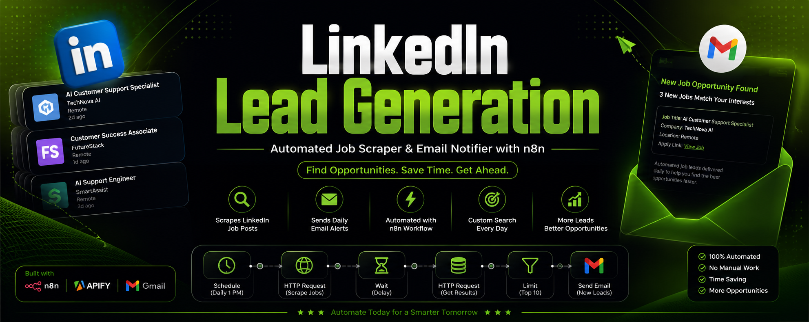
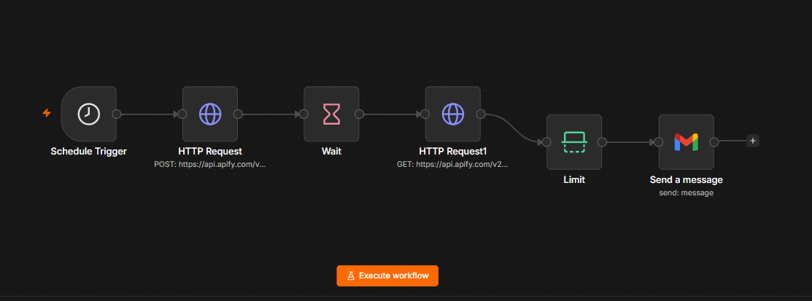

<p align="center">
  
</p>

# 💼 LinkedIn Lead Generation - n8n Workflow

An open-source LinkedIn job lead generation workflow built with **n8n**, **Apify**, and **Gmail**.

This workflow automatically scrapes LinkedIn job listings, filters the latest opportunities, and sends daily email notifications so you never miss AI Automation, Customer Support, and Remote job opportunities.

---

# ✨ Features

- 🔍 Automatically scrape LinkedIn job listings
- ⏰ Daily scheduled execution
- 🚀 Powered by Apify LinkedIn Job Scraper
- 📧 Send email notifications with Gmail
- 🎯 Filter and limit the latest job opportunities
- ⚡ Fully automated workflow
- 🔓 Open-source and easy to customize

---

# 📷 Workflow Preview

<p align="center">
  
</p>

---

# ⚙️ Tech Stack

- n8n
- Apify
- LinkedIn Jobs
- Gmail
- HTTP Request
- Schedule Trigger

---

# 📦 Installation

1. Download **workflow.json** from this repository.
2. Open your n8n instance.
3. Click **Import Workflow**.
4. Select **workflow.json**.
5. Configure your credentials:
   - Apify API Token
   - Gmail OAuth2
6. Update your LinkedIn Job Search URL.
7. Activate the workflow.

---

# 📁 Repository Structure

```text
linkedin-lead-generation-n8n/
│
├── workflow.json
├── README.md
├── LICENSE
├── banner.png
└── screenshots/
      └── workflow.png
```

---

# 🔄 Workflow Process

```text
Schedule Trigger
        │
        ▼
Run Apify LinkedIn Job Scraper
        │
        ▼
Wait for Scraper
        │
        ▼
Fetch Dataset Results
        │
        ▼
Limit Results (Top 10)
        │
        ▼
Send Email Notifications
```

---

# 📧 Email Notification

**Subject**

```text
New Job: AI Customer Support at Company Name
```

**Email Body**

```text
Job Title:
Company:
Location:
Apply Link:
```

---

# 📌 Requirements

- n8n
- Apify Account
- Gmail Account
- LinkedIn Job Search URL

---

# 🚀 Use Cases

- AI Automation Jobs
- Customer Support Jobs
- Remote Jobs
- LinkedIn Job Alerts
- Daily Lead Generation
- Job Monitoring

---

# 🤝 Contributing

Contributions, feature requests, and improvements are welcome.

If you find this project useful, don't forget to ⭐ star this repository.

---

# 📄 License

This project is licensed under the **MIT License**.

---

# 👨‍💻 Author

**Muhammad Habib**

AI Automation Developer

GitHub:
https://github.com/Bakhti32102

LinkedIn:
https://www.linkedin.com/in/muhammad-habib/
